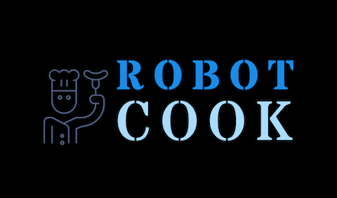
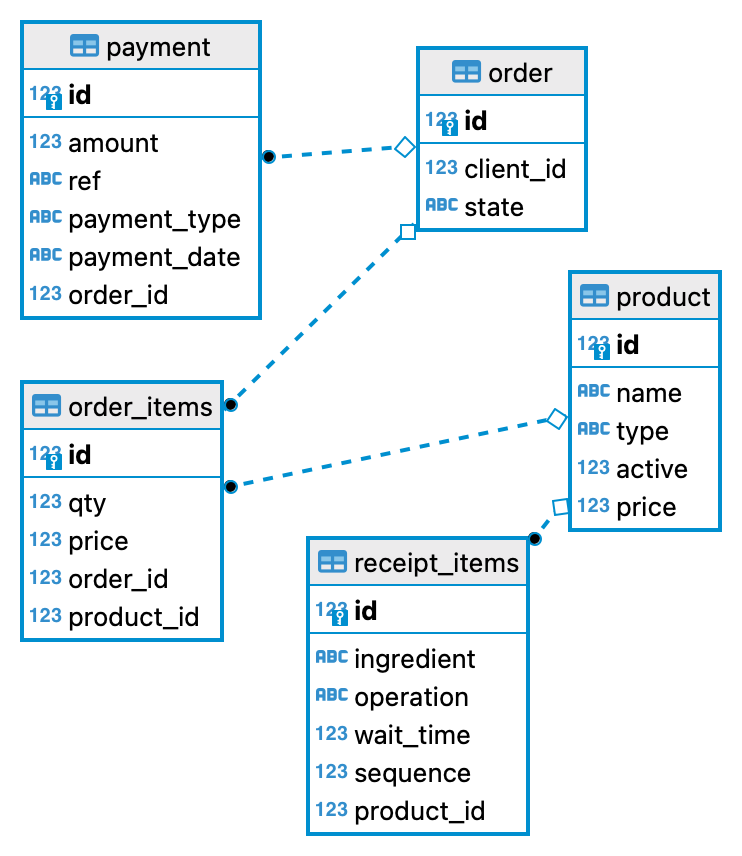

# RobotCook

# Proto
* It all starts with a lunchbox. Lunchbox is placed in the **Box basket**.
* All products enter the lunchbox in a sequence.
* Each ingredient comes from the ***Dispenser*** to the gravitational principle.
* ***Dispenser*** can be group by Type.
* Every ***Dispenser*** in group have the same offset angle.
* The ingredient can enter the lunchbox directly or through a ***Processing center***. For directly move **Box basket** under ***Dispenser*** coordinates. For operations inside the processing center, a **Processing basket** is used.
* Every ***Dispenser*** and centers axes of symmetry ***Processing center***  equidistant from the **Center**.
* Manipulator in the **Сenter**

# Receipt
Burger receipt example
| Ingredient      | Operation | Operatinon time|
| ----------- | ----------- |-------------|
| Bun Bottom  |             |             |
| Salad       |             |             |
| Burger      | Grill       |      180    |
| Onion       |             |             |
| Tomato      |             |             |
| Pickle      |             |             |
| Mustard     |             |             |
| Bun top     |             |             |

See recipes.csv file for more receipts.

## Processing centers
Processing center **Roster** has ***Operations***: Grill, Oven, Confection\
**Boiling water** with **Boiling**\
**Fryer** with **Fryer** operation
## Tools
* Processing basket
* Box basket

## Database.
Source of diagram docs/diagram.erd

