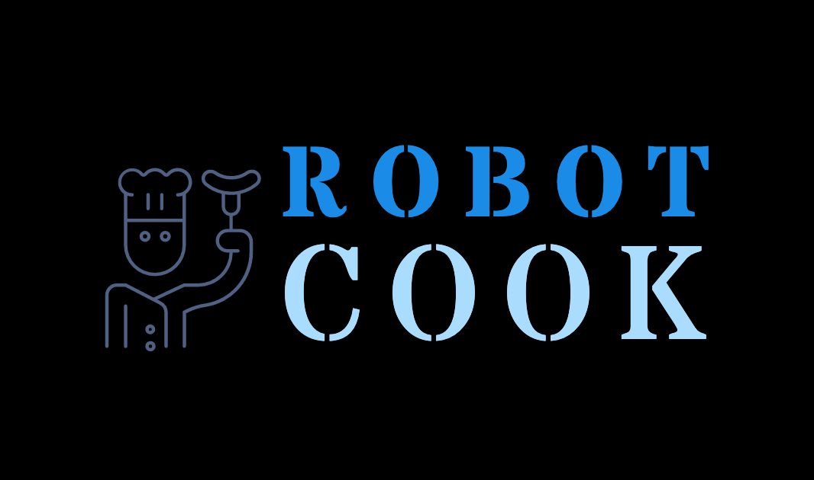

# RobotCook

# Proto
* It all starts with a lunchbox. Lunchbox is placed in the **Box basket**.
* All products enter the lunchbox in a sequence.
* Each ingredient comes from the ***Dispenser*** to the gravitational principle.
* The ingredient can enter the lunchbox directly or through a ***Processing center***. For directly move **Box basket** under ***Dispenser*** coordinates. For operations inside the processing center, a **Processing basket** is used.
# Receipt
Burger receipt example
| Ingredient      | Operation | Operatinon time|
| ----------- | ----------- |-------------|
| Bun Bottom  |             |             |
| Salad       |             |             |
| Burger      | Grill       |      180    |
| Onion       |             |             |
| Tomato      |             |             |
| Pickle      |             |             |
| Mustard     |             |             |
| Bun top     |             |             |

## Processing centers
Processing center **Roster** has ***Operations***: Grill, Oven, Confection\
**Boiling water** with **Boiling**\
**Fryer** with **Fryer** operation
## Tools
* Processing basket
* Box basket
## Main Parts
### ARM
#1 Niryo : https://niryo.com/

#2 DOBOT :Dobot Magician - Bring Industrial Robotic Arm to Daily Life, 3D Printer, Laser Engraver and more!
       https://www.dobot.cc/dobot-magician/p...

#3  BCN3D MOVEO - A fully OpenSource 3D printed Robot Arm
       https://www.bcn3dtechnologies.com/en/...
       future-of-learning/

#4 Thor - The Open Source Robotic Arm
       https://hackaday.io/project/12989-thor

#5 Evil Minion – affordable and open source robotic arm for 
     teachers, makers, and manufacturers
     https://www.marginallyclever.com 
### ARM tool
#### Basket
#### Spatula
#### Pliers
### Ingradients dosators
