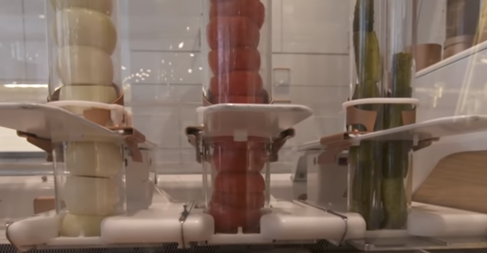

# RobotCook

# Уважаемый рекрутер, шаришь в python? 

[Набери в поиске данной репы "Современные штучки" что бы узнать какой я современный)](https://github.com/pyton4ik/RobotCook/search?q=%D0%A1%D0%BE%D0%B2%D1%80%D0%B5%D0%BC%D0%B5%D0%BD%D0%BD%D1%8B%D0%B5+%D1%88%D1%82%D1%83%D1%87%D0%BA%D0%B8)

# Термины
### Манипулятор
Может брать и ставить класть на место 'Инструменты'.
Ничего не делает без 'Инструментов'.
## Маршрутизация
### Центр
Центр оси координат. В нем распологается 'Манипулятор'.
### Цех
Место где проиходит приготовление 'Инградиентов'. Может иметь один или несколько режимов обработки:

    Ростер имеет операции: Гриль, Печь, Конвекция
    Кипящая вода операцию "Кинячение"
    Фррирюрница с режимом "Фритюр"

## Сырье
### Ланчбокс
Обычный ланчбокс из пластика, картона и тд
### Инградиент
Исходные продукты из которых будет состоять конечный продукт.
### Диспенсер
Место из которого поступают "Инградиент"ы. Распологаются по кругу от центра, 
на одной высоте (DISPENSER_Z_COORD).
Так мы всегда можем вычислить 3D Координаты по только по одному параметру - 
угол смещения, как в часах с одной стрелкой.
Продукты для подачи обработаны и расфасованы так что бы можно было 
из подавать по гравитационному принципу. 
Бывают следующих типов:
#### Холодильник
Здесь хранятся продукты, требующие хранения в холодильнике:
Котлеты для бургеров, сыр и прочее.

#### Слайсер
Отсюда поступают уже нарезанные овощи: помидор, оругец, лук.

#### Соус
Кенчуп, майоне, горчица

#### Пюре

#### Хлеб

#### Ланчбокс
'Ланчбокс'ы подаются из своего собственного диспенсера

## Инструменты
### Корзина для коробки
### Конзина для обработки

# Рецепт
Пример рецепта бургера
| Ingredient      | Operation | Operatinon time|
| ----------- | ----------- |-------------|
| Bun Bottom  |             |             |
| Salad       |             |             |
| Burger      | Grill       |      180    |
| Onion       |             |             |
| Tomato      |             |             |
| Pickle      |             |             |
| Mustard     |             |             |
| Bun top     |             |             |

See recipes.csv file for more receipts.
    
# Proto
* It all starts with a lunchbox. Lunchbox is placed in the **Box basket**.
* All products enter the lunchbox in a sequence.
* Each ingredient comes from the ***Dispenser*** to the gravitational principle.
* ***Dispenser*** can be group by Type.
* Every ***Dispenser*** in group have the same offset angle.
* The ingredient can enter the lunchbox directly or through a ***Processing center***. For directly move **Box basket** under ***Dispenser*** coordinates. For operations inside the processing center, a **Processing basket** is used.
* Every ***Dispenser*** and centers axes of symmetry ***Processing center***  equidistant from the **Center**.
* Manipulator in the **Сenter**

## Database.
Source of diagram docs/diagram.erd

